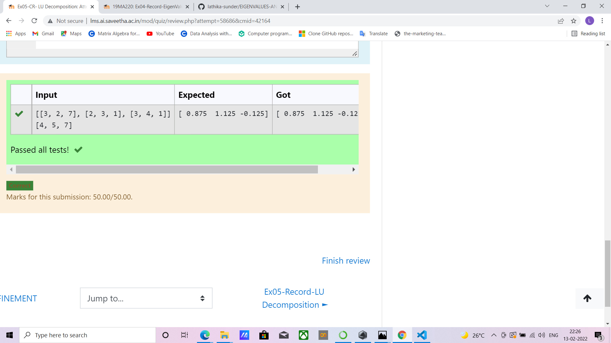
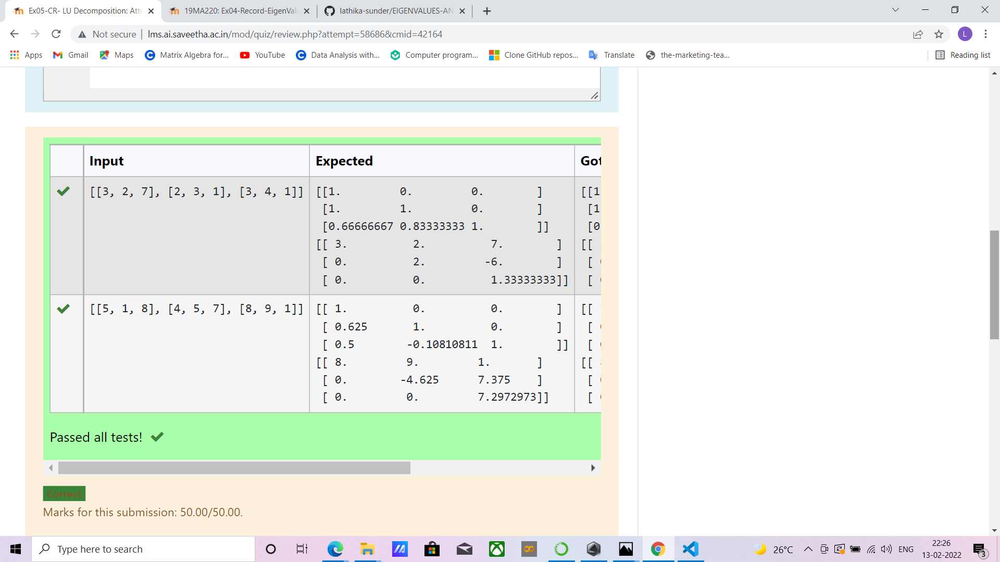

# LU Decomposition 

## AIM:
To write a program to find the LU Decomposition of a matrix.

## Equipments Required:
1. Hardware – PCs
2. Anaconda – Python 3.7 Installation / Moodle-Code Runner

## Algorithm
1. import numpy library using import satement
2. from scipy package import lu().
3. get input from user and pass it as an array
4. get P,L U matric using lu().
5. print L and U matrix

## Program:
```'''Program to find L and U matrix using LU decomposition.
Developed by: Lathika Sunder
RegisterNumber:212221230054
'''

# To print L and U matrix
import numpy as np
from scipy.linalg import lu
A = np.array(eval(input()))
P, L, U = lu(A)
print(L)
print(U)
```

```
'''Program to solve a matrix using LU decomposition.
Developed by: Lathika Sunder
RegisterNumber:212221230054
'''

# To print X matrix (solution to the equations)
import numpy as np
from scipy.linalg import lu_factor, lu_solve
A = np.array(eval(input()))
B = np.array(eval(input()))
lu, pivot = lu_factor(A)
x = lu_solve((lu,pivot),B)
print(x)
```

## Output:




## Result:
Thus the program to find the LU Decomposition of a matrix is written and verified using python programming.
